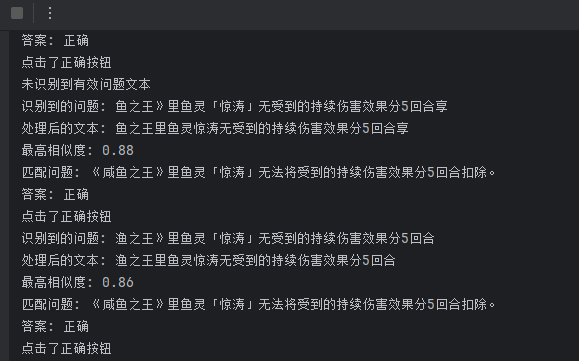
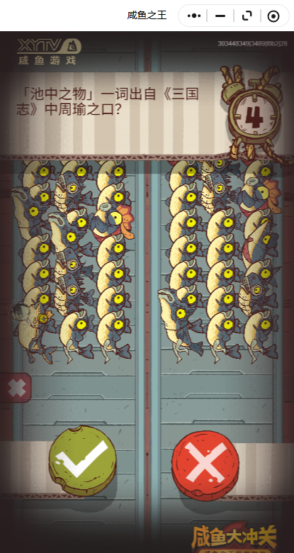
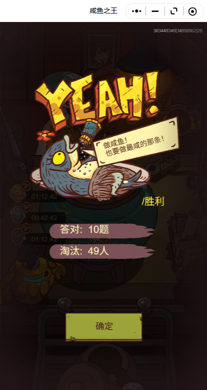

# fish-kingdoms

#### 介绍
咸鱼之王每日任务答题

#### 实现方案
通过文字识别获取每日比赛中题干的信息，之后去匹配题库中的答案，根据 √ 或 × 去自动点击正确 or 错误

1. 读取 output.json 中的题库内容
2. 通过 tkinter 来选定问题区域和对、错按钮位置
3. 通过 paddleocr 获取问题区域的问题内容
4. 通过 Levenshtein 进行获取到的内容与题库问题对比并根据答案点击对/错按钮

#### 效果预览

